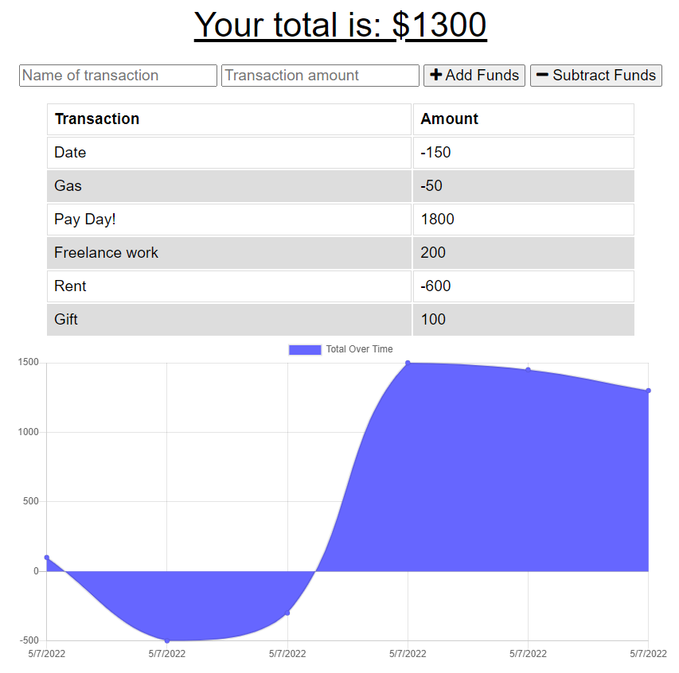

# Budget Tracker

## About the Project

Welcome to my Budget Tracker! This application is a simple-but-effective framework for a social network application. Using the API, users can be created and managed, as well as post thoughts and react to other thoughts.

[Click here to check out the deployed application!](https://shielded-stream-03290.herokuapp.com/)

## Table of Contents

- [Examples of Use](#examples-of-use)
- [Contributions](#contributions)
- [License Information](#license-information)
- [Contact Me](#contact-me)

## Examples of Use

- Enter the label for a transaction, the amount, then add funds or subtract them from your total
- Your total will be tracked in a graph as soon as each transaction is inputted

## Contributions

- Completed with direction and starter code from the Vanderbilt Full-Stack Coding Bootcamp

## License Information

Copyright (c) by William Ingram, 2022

Licensed under the [MIT](https://opensource.org/licenses/MIT) license.

## Contact Me

- GitHub: wingram1
- Email: waingram96@gmail.com
